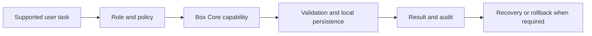

# CLARYEL Box Core user guides

- Repository: `claryel-company/claryel-boxcore`
- Guide owner: Box Core Product and Operations Owner
- Structural validation: `2026-08-02`
- Status: `needs-live-scenario-validation`

## Purpose

Use CLARYEL Box Core through supported interfaces and repository-owned workflows while preserving local-first operation, explicit permissions, validation, recovery and auditable change control.

## Roles

| Role | Goal |
|---|---|
| Administrator | Configure approved services, roles, storage, integrations, backup and recovery |
| Operator | Observe health, perform documented routine actions and handle degraded states |
| Developer or professional role | Extend or use a bounded capability through reviewed interfaces |
| End user | Complete a supported local-first task without infrastructure knowledge |

## Simplest successful path

1. Select one supported Box Core capability and confirm the active repository and intended environment.
2. Review prerequisites, input data, permissions and expected result.
3. Perform the task through the supported interface or reviewed repository workflow.
4. Verify the visible result, local persistence, audit evidence and rollback path.

Expected result: the task completes through a bounded capability, local data remains controlled and no advisory external system receives production authority.

## Visual map

## Subscription-backed AI

Official ChatGPT, Codex, Claude, Claude Code, Gemini, Grok, Perplexity and Qwen Coder subscription surfaces may assist with public research, sanitised active-scope analysis, specifications, tests, documentation and proposed patches. Their results remain advisory until independently reviewed and validated. They never receive production secrets, unrestricted customer data, merge authority, deployment authority or direct node-execution rights. See `claryel-platform` ADR-0033.

## Administrator path

1. Approve the exact service, identity, permissions, storage and network boundary.
2. Keep passwords, private keys, recovery codes, cookies and production credentials outside Git, prompts, logs and screenshots.
3. Separate local runtime authority from external advisory analysis.
4. Test backup, restore, revocation, degraded operation and rollback.
5. Remove access without leaving reusable credentials or hidden external dependencies.

## Operator path

1. Confirm service health, data freshness and the current production revision.
2. Use only documented routine actions and bounded capabilities.
3. Preserve before-and-after evidence without secret values.
4. Stop on unexpected privilege, identity, destructive storage or external disclosure requests.
5. Use the local fallback when an advisory provider is unavailable or quota-limited.

## Developer or professional-role path

1. Read the central architecture, accepted ADRs and repository entry rules.
2. Restrict work to the active repository scope.
3. Use a branch, tests, Pull Request and CI for code or configuration changes.
4. Record assumptions, evidence, risks, rollback and acceptance criteria.
5. Update this user-guide layer when a role, permission, interface, failure mode or recovery path changes.

## End-user path

1. Open the supported application or interface.
2. Select the visible task and provide only the required information.
3. Check the expected result and explicit success or degraded status.
4. Report problems without sending passwords, private keys or recovery codes.

## Common problems

| Symptom | Safe action |
|---|---|
| Service is unavailable | Check the documented health view and use the local recovery or fallback path |
| Advisory provider is unavailable | Mark the provider degraded and continue with a local or approved alternative workflow |
| Output contains an unsupported claim or code change | Keep it advisory and require independent evidence, tests and review |
| Storage or persistence warning appears | Stop risky writes, preserve evidence and follow the recovery runbook |
| Unexpected permission is requested | Cancel the action and escalate to the administrator |

## Accessibility and localisation

Supported interfaces and instructions must provide keyboard operation, visible focus, meaningful status and error text, useful alternative text and understandable terminology. Public repository documentation remains English-canonical under ADR-0024; product presentation may use the approved managed-localisation layer.

## Scenario validation

| Scenario | State | Required evidence |
|---|---|---|
| First supported end-user task | Live test pending | Completion without undocumented help |
| Administrator access and revocation | Live test pending | Least privilege and verified removal |
| Advisory provider failure | Live test pending | Visible degraded state and local fallback |
| Backup and recovery | Live test pending | Retained restore evidence |
| Proposed code change | Live test pending | Branch, tests, Pull Request, CI and review |
| Accessibility | Interface test pending | Keyboard and screen-reader evidence |

## Technical references

- Central architecture and active-only scope: `claryel-company/claryel-platform`
- Subscription workbench: ADR-0033
- Public repository language policy: ADR-0024
- Repository rules: `AGENTS.md`
- Current work: `NEXT_STEPS.md`

Review this guide after any service, role, permission, interface, storage, provider, validation, recovery or rollback change.
