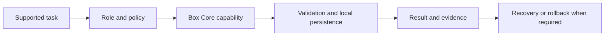

# CLARYEL Box Core user guides

- Repository: `claryel-company/claryel-boxcore`
- Guide owner: Box Core Product and Operations Owner
- Structural validation: `2026-08-02`
- Status: `structure-validated-live-scenarios-pending`
- Canonical language: English

## Purpose

Use CLARYEL Box Core through supported public interfaces and reviewed repository workflows while preserving local-first operation, explicit permissions, independent validation, recovery and auditable change control.

All durable project instructions are English only under `claryel-platform` ADR-0034. Managed localised product help may exist elsewhere, but it is not an alternative technical specification.

## Roles

| Role | Goal | Boundary |
|---|---|---|
| Documentation Owner | Maintain English-only public documentation, terminology and evidence links | Must not redefine architecture without an ADR |
| Repository Maintainer | Implement, test and release public open-core capabilities | Must remain inside the Box Core ownership boundary |
| Security and Compliance Operator | Review disclosure, licensing, trust boundaries and public evidence | Must reject secrets, customer data and unpatched findings |
| Product and Business Operator | Maintain verified product, funding and grant facts | Must separate requested, planned, implemented and validated states |
| External Contributor | Propose public changes through issues and Pull Requests | Has no private-system or production authority |
| End User | Use a supported public capability and report outcomes | Does not perform repository or deployment administration |

## Simplest successful path

1. Select one supported Box Core capability and confirm the active repository and intended environment.
2. Review prerequisites, input data, permissions and expected result.
3. Perform the task through the supported interface or reviewed repository workflow.
4. Verify the visible result, local persistence, audit evidence and rollback path.

Expected result: the task completes through a bounded capability, local data remains controlled and no advisory external system receives production authority.

## Visual map

## Documentation Owner path

1. Run the documentation-language validation workflow.
2. Remove or rewrite non-English canonical text.
3. Keep localisation resources outside authoritative technical documentation.
4. Repair broken links, tables, diagrams and terminology.
5. Escalate statements that change architecture, legal meaning, security guarantees or capability status.

## Repository Maintainer path

1. Read central architecture, ADR-0032, ADR-0034 and repository entry rules.
2. Restrict work to active repositories and Box Core-owned capabilities.
3. Use a branch, deterministic tests, Pull Request and CI.
4. Record assumptions, evidence, risks, rollback and acceptance criteria.
5. Update `NEXT_STEPS.md`, public status evidence and this guide when user-visible behaviour changes.

## Security and Compliance Operator path

1. Review data classification, public disclosure, licensing and provenance.
2. Reject credentials, personal data, customer data, private topology and unresolved security findings.
3. Confirm hardware and execution capabilities are deny-by-default and capability-gated.
4. Preserve evidence without exposing inaccessible source content.

## Product and Business Operator path

1. Separate verified facts, planning assumptions and unknowns.
2. Keep funding requests distinct from awarded funding.
3. Keep implementation, validation, release and deployment states separate.
4. Link every public claim to current evidence.

## External Contributor path

1. Use English for issues, Pull Requests and durable project communication.
2. Work only on the requested public scope.
3. Include tests, documentation and rollback information.
4. Do not claim access to private repositories, customer systems or production deployment.

## End User path

1. Open the supported application or interface.
2. Select the visible task and provide only required information.
3. Check the expected result and explicit success or degraded status.
4. Report problems without sending passwords, private keys, recovery codes or unrelated personal data.

## Subscription-backed AI

Official ChatGPT or Codex, Claude or Claude Code, Gemini, Grok, Perplexity and Qwen Coder subscription surfaces may assist with public research, sanitised active-scope analysis, specifications, tests, documentation and proposed patches. Their results remain advisory until independently reviewed and validated. They never receive production secrets, unrestricted customer data, merge authority, deployment authority or direct node-execution rights. See `claryel-platform` ADR-0033.

## Common problems

| Symptom | Safe action |
|---|---|
| Documentation-language validation fails | Remove or rewrite non-English canonical text and rerun validation |
| Service is unavailable | Check the documented health view and use the local recovery or fallback path |
| Advisory provider is unavailable | Mark the provider degraded and continue with a local or approved alternative workflow |
| Output contains an unsupported claim or code change | Keep it advisory and require independent evidence, tests and review |
| Unexpected permission is requested | Cancel the action and escalate to the Security and Compliance Operator |

## Scenario validation

| Scenario | State | Required evidence |
|---|---|---|
| English-only documentation | Automated gate enabled | Passing workflow and no localisation mixed into technical documentation |
| First supported end-user task | Live test pending | Completion without undocumented help |
| Public disclosure review | Live test pending | Provenance, sanitisation and licence evidence |
| Proposed code change | Live test pending | Branch, tests, Pull Request, CI and review |
| Accessibility | Interface test pending | Keyboard and screen-reader evidence |

## Technical references

- Central architecture and active-only scope: `claryel-company/claryel-platform`
- Documentation language: ADR-0034
- Subscription workbench: ADR-0033
- Repository rules: `AGENTS.md`
- Current work: `NEXT_STEPS.md`

Review this guide after any role, permission, interface, disclosure, provider, validation, recovery or rollback change.
